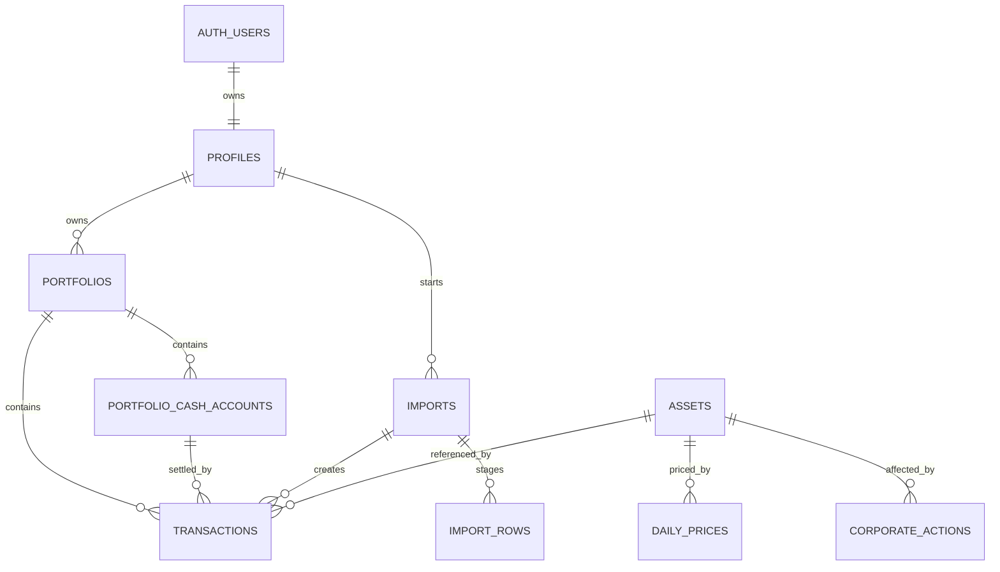

# PFP Database Model

This document describes the proposed Supabase/PostgreSQL database model for PF Planner (PFP).

It is a design specification for future migrations. It should be kept in sync with `PFP design.md`, `AGENTS.md`, and any Supabase migration files once the project is scaffolded.

## Goals

The database must support the Phase 1 MVP:

- Multiple user portfolios.
- Manual transactions.
- Stocks, ETFs, and crypto assets.
- Dividends.
- Fees and taxes.
- Portfolio cash accounts and cash movements.
- Realized and unrealized P/L.
- Holdings overview.
- Portfolio allocation.
- Daily historical market prices.
- CSV, Google Sheets, and paste-based imports.

The model must also remain ready for later modules:

- Czech tax estimation.
- FX exposure.
- Subscriptions.
- Real estate.
- Loans and liabilities.
- Retirement and long-term forecasting.
- AI financial insights.

## Core Principles

- Raw transactions are immutable financial records.
- Derived values, such as holdings and P/L, should be computed or cached from raw records.
- Corporate actions are stored separately from user transactions.
- Daily historical prices are stored permanently.
- Intraday prices are not permanently stored in the MVP.
- Currency is a first-class field.
- Money, prices, quantities, and FX rates use decimal-safe database types.
- RLS protects user-owned data.
- Shared reference data is writable only by trusted server jobs or administrators.
- Imports are validated and previewed before creating transactions.

## Naming And Type Conventions

- Table names use plural `snake_case`.
- Primary keys use `id uuid primary key default gen_random_uuid()`.
- Timestamps use `timestamptz`.
- Dates that represent market or transaction days use `date`.
- Currencies use uppercase ISO-style 3-letter codes, for example `CZK`, `EUR`, `USD`.
- Financial values use `numeric`, not floating-point types.
- User-owned records reference `auth.users` through `profiles.id`.

Recommended numeric conventions:

```sql
money_amount numeric(38, 8)
price_amount numeric(38, 12)
quantity_amount numeric(38, 12)
fx_rate numeric(38, 12)
```

Exact precision can be adjusted in migrations, but do not use `real`, `float`, or `double precision` for persisted financial values.

## Ownership Model

User-owned tables:

- `profiles`
- `portfolios`
- `portfolio_cash_accounts`
- `transactions`
- `imports`
- `import_rows`

Shared/reference tables:

- `assets`
- `daily_prices`
- `corporate_actions`
- `fx_rates`

Shared/reference tables should normally allow authenticated reads and deny normal user writes. Market-data sync jobs should write through trusted server-side code using service-role credentials.

## Relationship Overview



`fx_rates` is shared reference data used during reporting and valuation. It is intentionally not tied to a specific asset or portfolio by foreign key.

## Enums

Use Postgres enums or constrained text. Enums are stricter, but constrained text is easier to evolve. If using enums, create them through migrations.

Recommended values:

```sql
transaction_type:
  BUY
  SELL
  DIVIDEND
  FEE
  TAX
  CASH_DEPOSIT
  CASH_WITHDRAWAL
  CASH_ADJUSTMENT

asset_type:
  STOCK
  ETF
  CRYPTO
  CASH

corporate_action_type:
  DIVIDEND
  SPLIT

import_source:
  CSV
  GOOGLE_SHEETS
  PASTE
  BROKER
  MANUAL

import_status:
  DRAFT
  VALIDATING
  VALIDATED
  COMMITTED
  FAILED
  CANCELLED

import_row_status:
  PENDING
  VALID
  INVALID
  COMMITTED
  SKIPPED

cost_basis_method:
  FIFO
  AVERAGE
```

MVP assumption: use `FIFO` as the default portfolio performance method until `docs/portfolio-math.md` and `docs/tax-cz.md` define more precise rules. This is a product calculation default, not tax advice.

## Tables

## profiles

One row per authenticated Supabase user.

| Column | Type | Required | Notes |
| --- | --- | --- | --- |
| `id` | `uuid` | yes | Primary key. References `auth.users(id)` with cascade delete. |
| `display_name` | `text` | no | User-facing name. |
| `base_currency` | `char(3)` | yes | Default reporting currency. Default `CZK`. |
| `locale` | `text` | no | Example: `cs-CZ`, `en-US`. |
| `created_at` | `timestamptz` | yes | Default `now()`. |
| `updated_at` | `timestamptz` | yes | Default `now()`. |

Indexes and constraints:

- Primary key on `id`.
- Check `base_currency ~ '^[A-Z]{3}$'`.

RLS:

- Users can select, insert, update, and delete only their own profile row where `id = auth.uid()`.

## portfolios

User-owned investment portfolios.

| Column | Type | Required | Notes |
| --- | --- | --- | --- |
| `id` | `uuid` | yes | Primary key. |
| `user_id` | `uuid` | yes | References `profiles(id)` with cascade delete. |
| `name` | `text` | yes | User-facing portfolio name. |
| `base_currency` | `char(3)` | yes | Reporting currency for this portfolio. Default from profile when created. |
| `cost_basis_method` | `text` | yes | Default `FIFO`. |
| `is_archived` | `boolean` | yes | Default `false`. |
| `created_at` | `timestamptz` | yes | Default `now()`. |
| `updated_at` | `timestamptz` | yes | Default `now()`. |

Indexes and constraints:

- Index on `user_id`.
- Unique active portfolio name per user, preferably partial on `(user_id, lower(name)) where is_archived = false`.
- Check `base_currency ~ '^[A-Z]{3}$'`.
- Check `cost_basis_method in ('FIFO', 'AVERAGE')`.

RLS:

- Users can access only portfolios where `user_id = auth.uid()`.

## assets

Shared reference table for tradable or reportable instruments.

| Column | Type | Required | Notes |
| --- | --- | --- | --- |
| `id` | `uuid` | yes | Primary key. |
| `symbol` | `text` | yes | Normalized uppercase ticker/symbol. |
| `isin` | `text` | no | Optional ISIN used by manual search/import matching. |
| `broker` | `text` | yes | Broker, exchange, venue, or provider namespace, for example `PATRIA`, `XTB`, `NASDAQ`, `XETRA`, `CRYPTO`. |
| `name` | `text` | no | Human-readable asset name. |
| `currency` | `char(3)` | yes | Native trading currency. |
| `asset_type` | `text` | yes | `STOCK`, `ETF`, `CRYPTO`, or future type. |
| `data_provider` | `text` | no | Example: `yfinance`, `stooq`, `manual`. |
| `provider_symbol` | `text` | no | Provider-specific lookup symbol. |
| `is_active` | `boolean` | yes | Default `true`. |
| `created_at` | `timestamptz` | yes | Default `now()`. |
| `updated_at` | `timestamptz` | yes | Default `now()`. |

Indexes and constraints:

- Unique `(broker, symbol)`.
- Unique `isin` where `isin is not null`.
- Index on `(asset_type, currency)`.
- Check `currency ~ '^[A-Z]{3}$'`.
- Check `isin` uses the standard 12-character ISIN shape when present.
- Check `asset_type in ('STOCK', 'ETF', 'CRYPTO', 'CASH')` until expanded.

RLS:

- Authenticated users may read assets.
- Normal users may not insert, update, or delete assets.
- Trusted server jobs may write assets.

## portfolio_cash_accounts

User-owned cash ledgers inside a portfolio. These accounts represent broker or venue cash balances by currency, for example `PATRIA · CZK`, `XTB · EUR`, or `BYBIT · USD`.

Cash accounts are not shared market assets. They are portfolio state and should be displayed as holdings by deriving balances from immutable transaction rows.

| Column | Type | Required | Notes |
| --- | --- | --- | --- |
| `id` | `uuid` | yes | Primary key. |
| `portfolio_id` | `uuid` | yes | References `portfolios(id)` with cascade delete. |
| `broker` | `text` | yes | Broker, exchange, venue, or manual namespace. Examples: `PATRIA`, `XTB`, `BYBIT`, `MANUAL`. |
| `currency` | `char(3)` | yes | Cash account currency. |
| `name` | `text` | no | Optional display label when broker/currency is not enough. |
| `is_active` | `boolean` | yes | Default `true`. Inactive accounts remain available for history. |
| `created_at` | `timestamptz` | yes | Default `now()`. |
| `updated_at` | `timestamptz` | yes | Default `now()`. |

Indexes and constraints:

- Unique `(portfolio_id, lower(broker), currency)`.
- Index on `portfolio_id`.
- Check `broker` is not blank.
- Check `currency ~ '^[A-Z]{3}$'`.

RLS:

- Users can access cash accounts only through ownership of the parent portfolio.

Important semantics:

- Balances are derived, not stored as mutable current balances.
- Deposits, withdrawals, buy/sell settlement, dividends, fees, taxes, and corrections should be represented as immutable transaction rows.
- If a balance correction is needed, add `CASH_ADJUSTMENT`; do not overwrite prior cash movements.
- FX conversion is modeled as a paired `CASH_WITHDRAWAL` and `CASH_DEPOSIT` sharing `metadata.conversion_group_id`.

## transactions

Immutable user-owned financial events.

Transactions represent user-level portfolio activity. They are not market-level corporate action records.

| Column | Type | Required | Notes |
| --- | --- | --- | --- |
| `id` | `uuid` | yes | Primary key. |
| `portfolio_id` | `uuid` | yes | References `portfolios(id)` with cascade delete. |
| `asset_id` | `uuid` | conditional | References `assets(id)`. Required for `BUY`, `SELL`, and `DIVIDEND`. Optional for portfolio-level `FEE` or `TAX`. |
| `cash_account_id` | `uuid` | conditional | References `portfolio_cash_accounts(id)`. Required for cash-only movement types. Optional but recommended for `BUY`, `SELL`, `DIVIDEND`, `FEE`, and `TAX` once manual transaction entry supports cash settlement. |
| `type` | `text` | yes | `BUY`, `SELL`, `DIVIDEND`, `FEE`, `TAX`, `CASH_DEPOSIT`, `CASH_WITHDRAWAL`, or `CASH_ADJUSTMENT`. |
| `trade_date` | `date` | yes | Economic date of the event. |
| `settlement_date` | `date` | no | Optional later support. |
| `quantity` | `numeric(38, 12)` | conditional | Positive quantity for buys/sells. |
| `price` | `numeric(38, 12)` | conditional | Unit price for buys/sells. |
| `gross_amount` | `numeric(38, 8)` | no | Absolute cash amount before fee/tax when available. |
| `fee` | `numeric(38, 8)` | yes | Non-negative. Default `0`. |
| `tax` | `numeric(38, 8)` | yes | Non-negative. Default `0`. |
| `currency` | `char(3)` | yes | Currency of the transaction cash amounts. |
| `source` | `text` | yes | `MANUAL`, `CSV`, `GOOGLE_SHEETS`, `PASTE`, `BROKER`, etc. |
| `external_id` | `text` | no | Broker/import/provider row id when available. |
| `import_id` | `uuid` | no | References `imports(id)`. |
| `notes` | `text` | no | User notes or import explanation. |
| `metadata` | `jsonb` | yes | Default `{}`. For raw provider/import details. |
| `created_at` | `timestamptz` | yes | Default `now()`. |

Important semantics:

- Store amounts as positive values; `type` determines economic direction.
- `BUY` means cash leaves the portfolio for asset acquisition.
- `SELL` means cash enters the portfolio from asset sale.
- `DIVIDEND` means user-level cash income received for an asset.
- `FEE` and `TAX` represent explicit costs and can optionally reference an asset or related import.
- `CASH_DEPOSIT` increases a portfolio cash account and has no `asset_id`.
- `CASH_WITHDRAWAL` decreases a portfolio cash account and has no `asset_id`.
- `CASH_ADJUSTMENT` is an explicit correction row for cash reconciliation and has no `asset_id`.
- Currency conversion should create two rows: source-currency `CASH_WITHDRAWAL` and target-currency `CASH_DEPOSIT`, linked by `metadata.transaction_intent = 'FX_CONVERSION'` and the same `metadata.conversion_group_id`.
- A transaction `cash_account_id`, when present, must belong to the same portfolio as the transaction.
- Do not mutate transactions to handle splits, corrections, or recalculations. Add new records or corporate actions.

Indexes and constraints:

- Index on `portfolio_id`.
- Index on `(portfolio_id, trade_date desc)`.
- Index on `(asset_id, trade_date desc)`.
- Index on `(import_id)`.
- Unique partial index for imported rows when possible: `(portfolio_id, source, external_id)` where `external_id is not null`.
- Check `currency ~ '^[A-Z]{3}$'`.
- Check `fee >= 0`.
- Check `tax >= 0`.
- Check `type in ('BUY', 'SELL', 'DIVIDEND', 'FEE', 'TAX', 'CASH_DEPOSIT', 'CASH_WITHDRAWAL', 'CASH_ADJUSTMENT')`.
- Check `quantity > 0` for `BUY` and `SELL`.
- Check `price >= 0` for `BUY` and `SELL`.
- Check `asset_id is not null` for `BUY`, `SELL`, and `DIVIDEND`.
- Check cash-only transaction types have `cash_account_id`, `gross_amount`, and no `asset_id`, `quantity`, or `price`.
- Use a trigger to ensure `cash_account_id` belongs to the same portfolio as `portfolio_id`.

RLS:

- Users can access transactions only when they own the parent portfolio.
- Transaction policies should use an `exists` check against `portfolios`.

Example policy shape:

```sql
exists (
  select 1
  from portfolios p
  where p.id = transactions.portfolio_id
    and p.user_id = auth.uid()
)
```

## daily_prices

Shared daily historical OHLC price data.

| Column | Type | Required | Notes |
| --- | --- | --- | --- |
| `asset_id` | `uuid` | yes | References `assets(id)` with cascade delete. |
| `price_date` | `date` | yes | Market date. |
| `open` | `numeric(38, 12)` | no | Daily open. |
| `high` | `numeric(38, 12)` | no | Daily high. |
| `low` | `numeric(38, 12)` | no | Daily low. |
| `close` | `numeric(38, 12)` | yes | Daily close. |
| `adjusted_close` | `numeric(38, 12)` | no | Adjusted close when provider supplies it. |
| `volume` | `numeric(38, 8)` | no | Volume. Numeric allows crypto/fractional provider data. |
| `currency` | `char(3)` | yes | Price currency, usually the asset currency. |
| `source` | `text` | yes | Example: `yfinance`, `stooq`, `manual`. |
| `created_at` | `timestamptz` | yes | Default `now()`. |
| `updated_at` | `timestamptz` | yes | Default `now()`. |

Indexes and constraints:

- Primary key or unique key on `(asset_id, price_date)`.
- Index on `(price_date desc)`.
- Check `currency ~ '^[A-Z]{3}$'`.
- Check prices are non-negative when present.
- Check `high >= low` when both are present.

RLS:

- Authenticated users may read daily prices.
- Normal users may not write daily prices.
- Trusted market-data jobs may insert/upsert daily prices.

## corporate_actions

Shared market-level corporate action records.

Corporate actions describe events declared by issuers or market data providers. They are not the same thing as a user transaction.

| Column | Type | Required | Notes |
| --- | --- | --- | --- |
| `id` | `uuid` | yes | Primary key. |
| `asset_id` | `uuid` | yes | References `assets(id)` with cascade delete. |
| `type` | `text` | yes | `DIVIDEND` or `SPLIT` for MVP. |
| `ex_date` | `date` | yes | Ex-dividend or split ex-date. |
| `pay_date` | `date` | no | Dividend payment date when known. |
| `amount` | `numeric(38, 12)` | no | Dividend amount per share/unit. |
| `ratio` | `numeric(38, 12)` | no | Split ratio, for example `4` for 4-for-1. |
| `currency` | `char(3)` | no | Required for dividend actions. |
| `source` | `text` | yes | Data source. |
| `metadata` | `jsonb` | yes | Default `{}`. Provider raw data. |
| `created_at` | `timestamptz` | yes | Default `now()`. |
| `updated_at` | `timestamptz` | yes | Default `now()`. |

Dividend semantics:

- `corporate_actions.type = 'DIVIDEND'` describes the declared market-level dividend.
- `transactions.type = 'DIVIDEND'` describes cash actually received by a user.
- Income and performance calculations must avoid double-counting these two records.

Indexes and constraints:

- Index on `(asset_id, ex_date desc)`.
- Unique index on enough provider-normalized fields to avoid duplicate actions.
- Check `type in ('DIVIDEND', 'SPLIT')`.
- For dividends: `amount is not null`, `amount >= 0`, and `currency is not null`.
- For splits: `ratio is not null` and `ratio > 0`.

RLS:

- Authenticated users may read corporate actions.
- Normal users may not write corporate actions.
- Trusted market-data jobs may insert/upsert corporate actions.

## imports

User-owned import batches.

| Column | Type | Required | Notes |
| --- | --- | --- | --- |
| `id` | `uuid` | yes | Primary key. |
| `user_id` | `uuid` | yes | References `profiles(id)` with cascade delete. |
| `portfolio_id` | `uuid` | no | Target portfolio if known when import starts. |
| `source` | `text` | yes | `CSV`, `GOOGLE_SHEETS`, `PASTE`, `BROKER`, `MANUAL`. |
| `source_hash` | `text` | no | Hash of source content to detect duplicate imports. |
| `status` | `text` | yes | Import lifecycle status. |
| `file_name` | `text` | no | Original file name when available. |
| `row_count` | `integer` | no | Total parsed rows. |
| `committed_at` | `timestamptz` | no | Set after transactions are created. |
| `metadata` | `jsonb` | yes | Default `{}`. |
| `created_at` | `timestamptz` | yes | Default `now()`. |
| `updated_at` | `timestamptz` | yes | Default `now()`. |

Indexes and constraints:

- Index on `(user_id, created_at desc)`.
- Index on `(portfolio_id)`.
- Unique partial index on `(user_id, source_hash)` where `source_hash is not null`.
- Check `status` is one of the import status values.

RLS:

- Users can access only their own imports where `user_id = auth.uid()`.

## import_rows

Staging table for import validation and preview.

This table lets the app parse external data, show a preview, reject invalid rows, and create immutable transactions only after user confirmation.

| Column | Type | Required | Notes |
| --- | --- | --- | --- |
| `id` | `uuid` | yes | Primary key. |
| `import_id` | `uuid` | yes | References `imports(id)` with cascade delete. |
| `row_number` | `integer` | yes | Original row number. |
| `status` | `text` | yes | `PENDING`, `VALID`, `INVALID`, `COMMITTED`, `SKIPPED`. |
| `raw_data` | `jsonb` | yes | Original parsed row. |
| `parsed_data` | `jsonb` | yes | Normalized parsed values. |
| `error_messages` | `jsonb` | yes | Default `[]`. |
| `transaction_id` | `uuid` | no | References `transactions(id)` after commit. |
| `created_at` | `timestamptz` | yes | Default `now()`. |
| `updated_at` | `timestamptz` | yes | Default `now()`. |

Indexes and constraints:

- Unique `(import_id, row_number)`.
- Index on `(import_id, status)`.
- Check `row_number > 0`.
- Check `status` is one of the import row status values.

RLS:

- Users can access import rows only through ownership of the parent import.

## fx_rates

Shared reference table for daily FX rates.

FX exposure is Phase 2, but adding this model early prevents single-currency assumptions from spreading into the product.

| Column | Type | Required | Notes |
| --- | --- | --- | --- |
| `rate_date` | `date` | yes | Rate date. |
| `from_currency` | `char(3)` | yes | Currency being converted from. |
| `to_currency` | `char(3)` | yes | Currency being converted to. |
| `rate` | `numeric(38, 12)` | yes | Multiply amount in `from_currency` by this rate to get `to_currency`. |
| `source` | `text` | yes | Example: `ECB`, `manual`. |
| `created_at` | `timestamptz` | yes | Default `now()`. |
| `updated_at` | `timestamptz` | yes | Default `now()`. |

Indexes and constraints:

- Primary key or unique key on `(rate_date, from_currency, to_currency, source)`.
- Index on `(from_currency, to_currency, rate_date desc)`.
- Check both currency columns match `^[A-Z]{3}$`.
- Check `rate > 0`.

RLS:

- Authenticated users may read FX rates.
- Normal users may not write FX rates.
- Trusted data jobs may insert/upsert FX rates.

## Derived Data

These should not be core mutable source-of-truth tables in the MVP:

- Current holdings.
- Current cash balances.
- Allocation percentages.
- Realized P/L.
- Unrealized P/L.
- Portfolio performance series.
- Dividend totals.

Prefer computed queries, service functions, or materialized/cache tables that can be rebuilt from:

- `transactions`
- `portfolio_cash_accounts`
- `daily_prices`
- `corporate_actions`
- `fx_rates`

If cached derived tables are added later, include:

- Input date range.
- Calculation method.
- Currency.
- Source job id or timestamp.
- Rebuild strategy.

## Portfolio Math Assumptions

MVP calculation defaults:

- Raw transaction rows are the audit source of truth.
- Buy and sell quantities are positive.
- Fees and taxes are stored as positive costs.
- Transaction type determines cash direction.
- Corporate splits adjust derived quantities and prices during calculation, not original transactions.
- Adjusted close should be used for historical performance when appropriate.
- `FIFO` is the default cost basis method for MVP performance displays until changed by product docs.
- Czech tax-specific treatment must be defined separately before tax estimates are presented to users.

## RLS Policy Intent

Minimum policy coverage:

- `profiles`: user can access `id = auth.uid()`.
- `portfolios`: user can access `user_id = auth.uid()`.
- `transactions`: user can access rows whose portfolio belongs to `auth.uid()`.
- `portfolio_cash_accounts`: user can access rows whose portfolio belongs to `auth.uid()`.
- `imports`: user can access `user_id = auth.uid()`.
- `import_rows`: user can access rows whose import belongs to `auth.uid()`.
- `assets`: authenticated users can read.
- `daily_prices`: authenticated users can read.
- `corporate_actions`: authenticated users can read.
- `fx_rates`: authenticated users can read.

Do not add normal-user write policies for shared/reference tables unless the product explicitly adds user-created custom assets.

Example transaction policy shape:

```sql
create policy "Users can read own portfolio transactions"
on transactions
for select
using (
  exists (
    select 1
    from portfolios p
    where p.id = transactions.portfolio_id
      and p.user_id = auth.uid()
  )
);
```

Apply similar `exists` policies for inserts where the parent portfolio is owned by the current user.

Important: raw transactions are conceptually immutable. Avoid update/delete policies for transactions unless a deliberate correction workflow exists. If the MVP allows user correction or deletion in the UI, prefer soft correction records or audit fields before tax features are implemented.

## Recommended Migration Order

1. Enable required extensions, such as `pgcrypto` if needed for UUID generation.
2. Create enum types or constrained text domains.
3. Create `profiles`.
4. Create shared reference tables: `assets`, `daily_prices`, `corporate_actions`, `fx_rates`.
5. Create user-owned portfolio tables: `portfolios`, `portfolio_cash_accounts`, `imports`, `import_rows`, `transactions`.
6. Add indexes and unique constraints.
7. Enable RLS on all user-owned tables.
8. Add read-only RLS for shared/reference tables.
9. Add ownership policies for user-owned tables.
10. Add triggers for `updated_at`.
11. Add seed data or provider sync jobs separately.

## Open Decisions

These should be resolved before writing production migrations:

- Whether to use Postgres enums or constrained text for evolving finance types.
- Whether normal users can create custom/manual assets.
- Exact cost basis methods supported in MVP.
- Exact correction workflow for immutable transaction mistakes.
- Whether import rows should be retained forever or pruned after commit.
- Runtime location for `yfinance` or any Python-based market-data job.
- Whether FX conversion should later become a dedicated table with two transaction ids and explicit provider/broker execution metadata.
